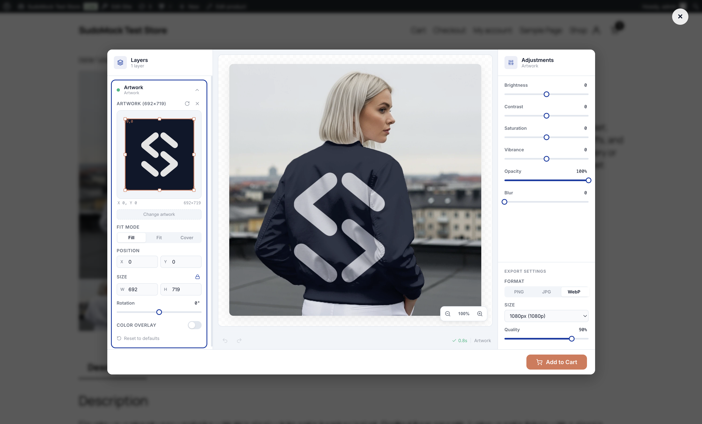

# SudoMock Product Customizer for WooCommerce

Let customers personalize products with professional PSD mockup designs in real-time. Upload your Photoshop mockups, map them to WooCommerce products, and offer a white-label customization experience on your storefront.

## Features

- **Real-Time PSD Rendering** — Sub-second renders with all 27 Photoshop blend modes
- **White-Label Studio** — Zero SudoMock branding visible to customers. Customize colors, labels, logo
- **WooCommerce Native** — HPOS compatible, Checkout Blocks compatible, Gutenberg block included
- **Mobile Optimized** — Touch-friendly controls, responsive layout, works on all devices
- **WordPress Customizer** — 30+ button styling options with live preview (classic themes)
- **Site Editor Block** — Drag-and-drop Product Customizer block (block themes)
- **Cart Integration** — Rendered preview in cart, persisted to order for fulfillment
- **10 Languages** — English, Turkish, German, French, Spanish, Portuguese, Italian, Dutch, Japanese, Korean, Chinese
- **GDPR Ready** — Privacy data exporter and eraser built-in
- **Secure** — API key encrypted at rest (AES-256-CBC), session tokens never expose credentials

## Requirements

- WordPress 6.0+
- WooCommerce 8.0+
- PHP 7.4+
- A free [SudoMock account](https://sudomock.com/register)

## Installation

1. Download the latest release ZIP
2. Go to **Plugins → Add New → Upload Plugin** in your WordPress admin
3. Upload the ZIP file and activate
4. Go to **SudoMock** in the admin sidebar
5. Click **Connect Account** and sign in to your SudoMock account
6. Upload PSD mockups at [sudomock.com/dashboard](https://sudomock.com/dashboard/playground)
7. Map mockups to products in the **Products** tab

## How It Works

1. **Upload PSD** — Upload Photoshop files with Smart Object layers to your SudoMock dashboard
2. **Map to Products** — Assign mockups to WooCommerce products from the plugin admin
3. **Customers Customize** — A "Customize" button appears on product pages. Customers upload artwork and preview in real-time
4. **Render & Cart** — Final mockup renders in <1 second, attaches to cart item, persists to order

## Pricing

Free to install. Pay only for renders:

| Plan | Credits | Price/mo | Parallel Renders |
|------|---------|----------|-----------------|
| Free | 500 one-time | $0 | 1 |
| Starter | 5K–100K/mo | $17.49–$179.99 | 3 |
| Pro | 5K–100K/mo | $27.49–$189.99 | 10 |
| Scale | 5K–100K/mo | $52.49–$214.99 | 25 |

Renders start at **$0.002 each** on higher volume plans. Dashboard and playground are free and unlimited.

[View full pricing →](https://sudomock.com/pricing)

## Documentation

- [WooCommerce Integration Guide](https://sudomock.com/integrations/woocommerce)
- [PSD Preparation Guide](https://sudomock.com/docs/psd-preparation)
- [API Documentation](https://sudomock.com/docs)
- [Smart Objects Guide](https://sudomock.com/docs/smart-objects)

## Support

- Email: hello@sudomock.com
- In-plugin support form (Settings tab)
- [Feature Requests](https://sudomock.featurebase.app)

## License

GPL v2 or later. See [LICENSE](LICENSE) for details.
